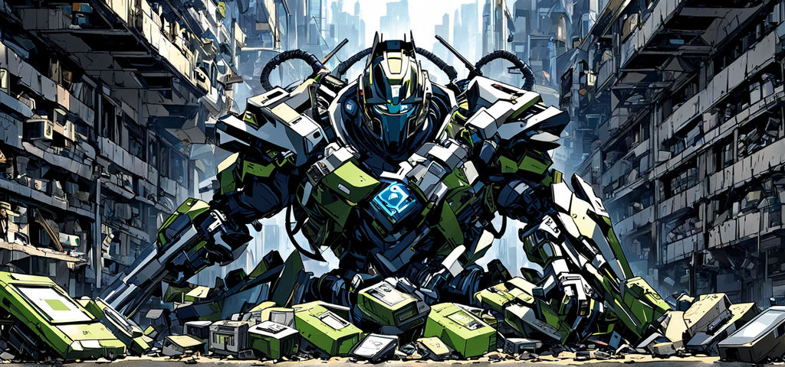

# Team Titans (E-Waste Hub)



#### How to run

##### To Run Client

    cd client

    npm install

    npm run start

##### To Run Server

1.  Install flask

    ```
    pip3 install Flask

    ```

2.  create and activate python environment

    ```
    cd server

    python3 -m venv .venv

    // in windows
    .venv\Scripts\activate

    // in mac
    source .venv/bin/activate
    ```

3.  run the flask app

    ```
    flask --app app run
    ```

---

#### Resource

##### Tech Documents

- React : https://react.dev/learn

- Flask : https://flask.palletsprojects.com/en/3.0.x/quickstart/

##### UI Framework and Design

- Tailwind : https://tailwindcss.com/

- Daisy UI : https://daisyui.com/

- Illustrations: https://storyset.com/search?q=waste

- Images and Icons : https://iconscout.com/

##### API Documents

- CeX API doc : https://github.com/Dionakra/webuy-api?tab=readme-ov-file#categories

- QR code generator API : https://goqr.me/api/

- Paypal Integration : https://medium.com/nerd-for-tech/integrating-paypal-sandbox-with-react-js-project-191caf0a7b53

- Stripe integration : https://docs.stripe.com/stripe-js/react?locale=en-GB

---

##### Courses

- Flask Course - Python Web Application Development : https://youtu.be/Qr4QMBUPxWo?feature=shared

- Learn Flask for Python - Full Tutorial: https://youtu.be/Z1RJmh_OqeA?feature=shared

- Tailwind (A MUST WATCH VIDEO) - https://www.youtube.com/watch?v=X6FIydgCzzY

- Flask + React integration - https://www.youtube.com/watch?v=7LNl2JlZKHA
